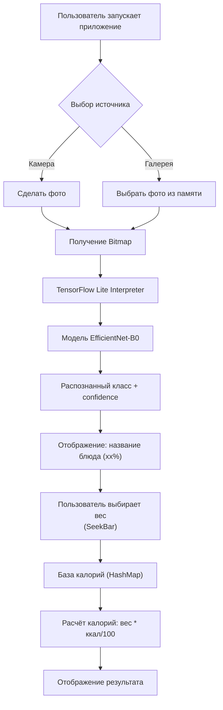

# NutriFit — AI-нутрициолог

Android-приложение для распознавания блюда по фотографии и расчёта калорийности с помощью нейросети. Курсовой проект по модулю «Прикладные задачи машинного и глубокого обучения».

##  Функции

-  Распознавание 101 класса еды (датасет Food-101) через камеру или галерею
-  Ползунок для выбора веса порции (граммы)
-  Автоматический расчёт калорий на основе базы данных
-  Material Design, карточки, адаптивный интерфейс

## Технологии

- **Языки:**  Java
- **Android SDK:** min 24, target 33
- **Машинное обучение:** TensorFlow Lite, модель EfficientNet-B0 (обучена на PyTorch, конвертирована в TFLite)
- **Камера:** CameraX
- **Загрузка изображений:** Glide
- **UI:** Material Design Components, ConstraintLayout, SeekBar, MaterialCardView


## Установка и запуск

1. Установите приложение на телефон с Android 7+.
2. **Важно:** Модель `food_classifier_float32.tflite` и файл меток `labels.txt` НЕ входят в репозиторий из-за большого размера. Скачайте их по ссылке: 
https://drive.google.com/drive/folders/1wKh24Te_4Bgy084CvmErIim_Ri6dh_SJ?usp=sharing
3. Поместите оба файла в папку `app/src/main/assets/` вашего проекта.
4. Соберите и запустите проект в Android Studio.

##  Обучение модели

- **Архитектура:** EfficientNet‑B0 (предобучена на ImageNet)
- **Датасет:** Food‑101 (101 000 изображений, 101 класс)
- **Фреймворк:** PyTorch
- **Аугментация:** RandomHorizontalFlip, RandomRotation, ColorJitter
- **Точность на валидации:** 80.8%

Полный код обучения в Google Colab см. в папке [training/](training/).


##  Структура проекта
```text
NutriFit/
├── app/
│   ├── src/
│   │   └── main/
│   │       ├── java/
│   │       │   └── com/example/nutrifit/
│   │       │       ├── MainActivity.java
│   │       │       └── FoodClassifier.java
│   │       ├── res/
│   │       │   ├── layout/
│   │       │   │   └── activity_main.xml
│   │       │   ├── values/
│   │       │   │   ├── colors.xml
│   │       │   │   ├── strings.xml
│   │       │   │   └── themes.xml
│   │       │   └── xml/
│   │       │       └── file_paths.xml
│   │       ├── assets/
│   │       │   ├── food_classifier_float32.tflite (игнорируется)
│   │       │   └── labels.txt
│   │       └── AndroidManifest.xml
│   ├── build.gradle
│   └── ...
├── training/
│   ├── train_model.ipynb
│   └── requirements.txt
├── screenshots/
│   ├── main_screen.png
│   ├── recognition_result.png
│   └── calories_result.png
├── .gitignore
└── README.md
```
##  Лицензия

MIT License. Проект выполнен в учебных целях.
